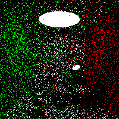

## A ray tracing demo implemented in Python

This repo is a pure Python version of [taichi_ray_tracing](https://github.com/erizmr/taichi_ray_tracing).

The current rendering result is as follows:

You can switch to different branches and see different rendering results:

1. <https://github.com/Theigrams/python_ray_tracing_demo/tree/1_0_color_only>
2. <https://github.com/Theigrams/python_ray_tracing_demo/tree/2_0_lambertian_reflection>
3. <https://github.com/Theigrams/python_ray_tracing_demo/tree/2_1_blinn_phong_model>
4. <https://github.com/Theigrams/python_ray_tracing_demo/tree/3_1_blinn_phong_with_shadow>
5. <https://github.com/Theigrams/python_ray_tracing_demo/tree/3_2_whitted_style_ray_tracing>
6. <https://github.com/Theigrams/python_ray_tracing_demo/tree/4_0_path_tracing>

Below is the gif of the Monte Carlo path tracing process:

